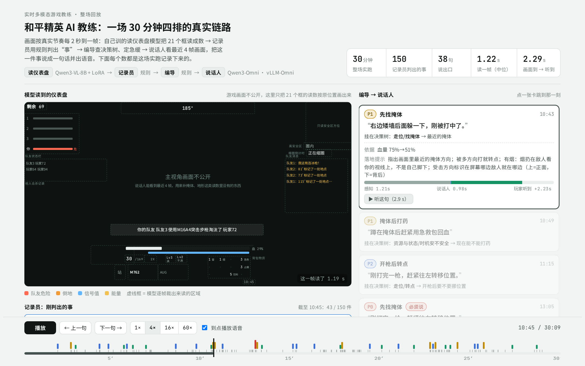
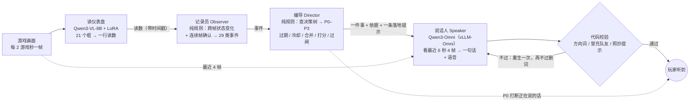
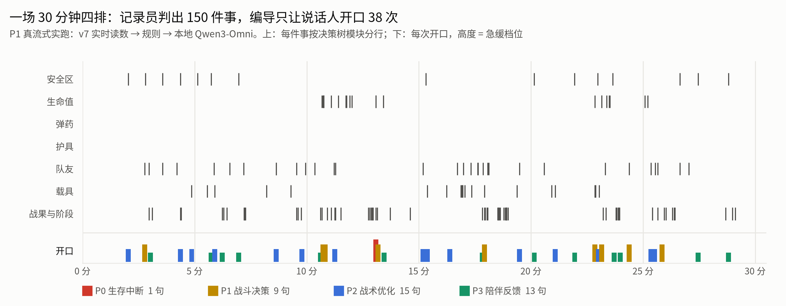

<div align="center">

# Realtime Game Coach Agent · 和平精英

**实时多模态游戏教练：只看屏幕画面，自己判断什么时候该提醒，说一句玩家能马上照做的话**

不接游戏内部数据。自己训的 VL 模型把仪表盘读成数 → 规则判出“事”、查决策树定急缓 → Qwen3-Omni 看最近几帧画面，把这一件事说成一句话并出语音。<br>
一场 30 分钟的四排实跑：画面到达到玩家听到，中位 **2.29 秒**。


</div>

<picture>
  <source media="(prefers-color-scheme: dark)" srcset="assets/demo_dark.jpg">
  
</picture>

> [!TIP]
> **Demo**：[`demo/index.html`](demo/index.html) 是一个单文件回放页（1.2 MB，数据和 38 句语音都内嵌），下载后用浏览器打开即可。一场 30 分钟四排的真实链路：左边是模型每 2 秒读到的仪表盘（游戏画面不公开，只把 21 个框的读数按原位置画出来），右边是每一句话的决策依据、挂在决策树哪一条、说话人原句和语音、这一句的延迟构成。我逐句审读时发现的两处错也原样标在卡片上。

---

## 四个要点

| | 做了什么 | 关键结果 | 证据 |
|---|---|---|---|
| **感知模型训练与优化** | 自己标数据（人审 6 场 **5,209 帧** + 粗标 **54 场**），LoRA 微调 Qwen3-VL-8B 读仪表盘 21 个框；训练预算按“每个字段还差多少”分配；每个框单独裁小图读（ROI） | 留出场 P8（860 帧，从未进训练）21 字段平均 **0.952**；ROI 比整帧推理**快 2.09×、准 +7.6pp**；读一帧 **5.29 s → 0.93 s**（合并 LoRA + 一批读 + vLLM，单卡 H20） | [docs/06](docs/06_hud_perception.md) · `data/perception/` |
| **事件检测与决策编排** | 记录员从跨帧状态变化判出 **29 类事件**，关键状态要**连续帧确认**才算；编导把事件挂到一棵决策树上（同事整理的对局决策框架，原件不公开），路由到进圈、治疗、支援等策略，**P0–P3 分档 + P0 抢占**，过期作废、冷却、同意图间隔都在触发层做 | 五场四排 148 分钟：**703 件事 → 216 句**（3.3 件事说 1 句），P0 必须说 9 句、打断 2 次；过期丢弃 198 条、同意图间隔拦下 76 次，**全部记账** | [docs/04](docs/04_coach_framework.md) · [docs/05](docs/05_rules_reference.md) · `tests/` |
| **多模态语音生成** | 说话人 Qwen3-Omni 只拿编导给的一件事 + 依据 + 一条落地提示 + 原始画面，补掩体、地形这类读数里没有的信息；生成后代码校验方向词 / 冒充队友 / 照抄提示；vLLM-Omni 本地部署，全部本地推理 | 五场全本地 **210 句，0 失败，每句含语音中位 1.10 s**（p90 1.31 s） | [docs/04 §4](docs/04_coach_framework.md#4-谁来说话全本地-11-秒一句) · `data/coach/speaker_local/` |
| **实时链路优化** | 事件触发（不定时问模型）+ **最小上下文**（当前这件事、最近 3 句、最近 6 秒 4 帧）；感知有延迟后：时间戳不外推、**拥塞时丢最旧帧**、事件字段不沿用上一帧 | 真流式整场（v7 实时读数 → 规则 → 本地 Omni，三者同机并发）：880 帧、38 句，**说话人忙而丢弃 0、失败 0**；画面到达 → 玩家听到**中位 2.29 s、最大 2.64 s** | [docs/04 §6](docs/04_coach_framework.md#6-真流式整场接上自己训的读仪表盘模型p1墙钟-30-分钟) · `data/coach/live_P1/` |

所有数字都能从 `data/` 复算：`python analysis/reproduce.py`（只用标准库，约 1 秒）。

> [!NOTE]
> **诚实的读法**：0.93 s/帧是单卡独占的实测，实跑时与说话人同机并发是 1.22 s；实跑那场 P1 在感知训练集里，留出场的数字以 P8 为准；规则层五场的结论用的是人审读数，接上模型读数后的多场端到端评测还没做；**“对玩家有没有用”没有做真实玩家评估**。详见 [局限](#局限)。

---

## 架构



**规则决定什么时候说、先说哪件；模型只把这一件事说成一句话；代码再核对说得对不对。** “圈外还有 1,500 米、已经开始缩圈”和“队友刚拿了个人头”哪个更急，不需要推理 —— 规则算得准、算得快、能一条条复查；AI 只做它不可替代的事：看画面、组织语言。

<picture>
  <source media="(prefers-color-scheme: dark)" srcset="assets/fig_timeline_dark.png">
  
</picture>

---

## 这个框架是怎么一步步来的

每一步都是从上一步暴露的问题推出来的。

### ① 为什么先从“解说”入手

AI 教练几乎没有公开了方法的研究（产品有，但做法都没公开）；而“看着连续画面、自己决定什么时候开口”这个核心问题，实时解说模型已经在做。区别在目标：解说越热闹越好，说错一句是瑕疵；**教练大部分时间该沉默，说错就是有害**。教练还多三条硬要求：说的事实能核对、真的看得懂画面、一两秒内说出来。

### ② 调研：三个现成的实时解说模型 → ③ 为什么都不适配

拿官方权重直接测（不训练 —— 从原始模型出发才看得清方法本身的问题）：

| | Proact-VL | MOSS-VL-Realtime | LiveStar |
|---|---|---|---|
| 怎么决定开口 | 每秒算一个开口分数，过阈值才说 | 每帧一个“说 / 不说”决策位 | 上一句话在新画面下的困惑度涨过阈值才说 |
| 和平精英上 | 读得准（命中率是随机的 12.3 倍），但**击杀归属会错**；长片**锁死**（最长连默 267 步） | 训练窗口长 21 倍，但**不看画面、在编比赛**（291 个数字命中率和瞎猜分不开） | 14.7 分钟长片**没认出是游戏**，击杀召回 0/18；同一命令跑 4 遍发言次数 3–5 次跳 |


<sub>同一段 LoL 官方 demo 片段第 20 秒（画面正中 “FIRST BLOOD!”）三个模型的解说。成品视频：[Proact-VL](demo/research/lol_proactvl.mp4) · [MOSS-VL](demo/research/lol_mossvl.mp4) · [LiveStar](demo/research/lol_livestar.mp4)</sub>

三个模型各有各的坏法，归结起来是一件事：**“什么时候开口”藏在模型内部** —— 外面调不动、复现不了、出了错查不到为什么。→ [docs/01](docs/01_research.md)

### ④ 另一条路：通用模型 + 外面定时问（Video2Text）

既然开口机制关在模型里，就换通用模型（千问 Omni / VL），由外面的代码决定多久问一次。通用模型**不训练就看得懂**画面（能认出击杀横幅和对手编号），但：

- **提示词管不住“什么时候说”**：只改提示词，沉默率从 15% 走到 98%；它还会给主角编编号
- **隔固定间隔问，必然慢半拍**：模型只在“问它”的那一刻看画面。隔 6 秒滞后中位 3.0 秒；隔 2 秒请求一多就排队；“念完再问”一句长话就是 9 秒没在看
- 评估解说时我用的尺子是“关键事件有没有被及时、正确地说到” —— **既然这样评，何不直接拿事件当开口的依据**

→ [docs/02](docs/02_video2text_and_qwen.md)

### ⑤ 决定：把“什么时候说”和“说什么”拆开

先做一个读画面的模型把仪表盘读成数；**何时说交给规则（事件触发），说什么交给模型，说得对不对交给代码**。规则不只是因为快，更是因为**可控、可复现**：读数对了、规则对了，跑多少次都会路由到同一条。

定型前走过两段路（[docs/03](docs/03_decision_and_early_attempts.md)）：

- **把整棵决策树塞进提示词、让千问自己挑**：76 条建议只有 2 条带数字（都是最大的那个剩余人数）；问自身状态（血量、子弹、护具）和问毒圈的分支从没当过主建议 —— 血条 4 像素高读不出、小地图看不懂、手里没有知识。想让它答对就得多给知识、多想，于是更慢：**对和快互相拖累**。规则把判断先做完，说话人只剩一件事和一条知识，两者才能同时拿到
- **先找底座，跑通“记录员 + 说话人”两层**（从 vLLM-Omni 抽出流式运行时，自己补触发和打断）：暴露三个问题 —— 说话时来的事被**悄悄丢掉**、话**重复**、只认击杀横幅一种事

### ⑥ 三层框架：记录员 → 编导 → 说话人

冲着那三个问题在中间加了一层**编导**：事件进候选池带有效期、丢了记账；冷却和间隔在触发层就把重复压掉；P0 可以打断正在说的话。之后边审片边修 —— 一条贯穿的规律：**数值判定写在事件里，落地写在表里，禁令写在提示词里，校验写在代码里**。

| 档 | 人话 | 说不出来的时候 |
|---|---|---|
| P0 | 再不做就要死了（圈外来不及、掉信号、血低还在掉） | **打断**正在说的话 |
| P1 | 这一枪这一步怎么办（掩体后打药、换弹、队友倒地） | **排队**，过了有效期也会丢 |
| P2 | 可以更好，但不着急（规划进圈、载具、开枪后转点） | 空闲才说，**过期作废** |
| P3 | 陪着你（夸赞、进圈了） | 空闲才说，**忙就丢** |

说话人只拿一张很窄的提示卡：这件事、挂在哪条决策项、依据、一条落地提示、最近说过的 3 句、最近 6 秒的 4 帧 —— **长度和对局时长无关**，第 30 分钟和第 1 分钟一样快。一句真实的话（P1 第 785 秒，血从 100% 掉到 10%）：规则判出“P0：找掩体”→ 说话人第一句“快进左边那栋绿屋！”→ 代码校验打回（“左边”没有可见物撑着）→ 重生“左边绿屋门口有矮墙，快贴上去！”。→ [docs/04](docs/04_coach_framework.md) · [docs/05](docs/05_rules_reference.md)

### ⑦ 读仪表盘的模型

<picture>
  <source media="(prefers-color-scheme: dark)" srcset="assets/fig_perception_dark.png">
  
</picture>

零样本基线先把“要不要训”变成了事实：大字（剩余人数、倒计时、横幅）≥0.95，细处（血量 0.01、信号 0.01、耐久 0.07）读不出，训练只该花在这 8 个字段上。v1 → v7 七版里最值钱的三条判据：

- **几个版本预测一致率高 = 标签错，加权没用；一致率低 = 模型错，加权有用** —— 按出现频次加权把护甲饿死了（每帧都有值 → 权重最低），改成按“还差多少”分预算，护甲 0.529 → 0.736
- **统计只能提假设，判定要回到像素**（两天里靠统计外推错过四次）
- **留出场必须真留出**；小验证集会高估（96 帧报副武器 0.565，全量只有 0.433）

<picture>
  <source media="(prefers-color-scheme: dark)" srcset="assets/fig_crop_dark.png">
  
</picture>

我一直想要“一整张图直接出全部结果”。为了证明切图有意义，**把模型固定住**（用唯一四档都训过的 v3、同一个 vLLM 进程）再比：整图慢 2.09×、准确率低 7.6pp —— 不是拿速度换精度，是两头都输。一个视觉 token 管 32×32 像素，4 像素高的血条被压没了；而整图一条输出要串行 325 步，切图 32 条并行、只等最长的约 40 步。**决定延迟的是串行步数，不是请求数。**

<picture>
  <source media="(prefers-color-scheme: dark)" srcset="assets/fig_latency_dark.png">
  
</picture>

教练每 2 游戏秒要一帧，读一帧必须在 2 秒内。合并 LoRA（每步少 504 次小矩阵乘的启动开销）、31 个框一批读、换 vLLM（不补空位 + CUDA graph），**每一步都在留出场核对精度**（P8 全量 0.9503 → 0.9507，无一字段差 ≥0.005）。试过没用的也记下了：按输出长短拆批反而慢（串行步数 35 → 48）、砍短提示词反而慢 13%（提示词在约束输出长度）。→ [docs/06](docs/06_hud_perception.md)

---

## 思考

1. **“什么时候说”和“说什么”是两个问题，应该分给两种东西。** 三个解说模型和“定时问通用模型”都把两者捆在一次模型调用里：前者关在权重里调不动，后者必然慢半拍。拆开以后，何时说变成了可核对、可复现的规则，模型只做它不可替代的部分。
2. **评估方法可以反过来变成系统设计。** 我评解说用的是“关键事件有没有被及时、正确地说到”，这把尺子后来直接成了记录员：事件出现就说，没有事件就闭嘴。
3. **规则层拦得住的错，就不该留给模型。** 编提示词挡不住的（编方向、冒充队友、复读），用代码校验；提示词写死示例会被原样照抄，所以示例也不放。规则 + 模型不是妥协，是各自放在最擅长的位置。
4. **训练预算要按“还差多少”分，而且先分清是标签错还是模型错。** 按频次加权看起来合理，却让每帧都出现的字段被饿死；一致率高说明模型们都“错得一样”，那多半是标签错了。
5. **延迟看串行深度，不看请求数和总计算量。** 切图 32 个请求比整图 1 个请求快，拆批反而慢，都是同一条原理。测延迟还要防假象：vLLM 前缀缓存会让同一帧重复测出 3 倍的假提速。
6. **报数字要说清口径。** 帧全对率 +14 点是全 21 字段口径，教练实际用的 18 个字段只 +2.5 点；召回要和随机零假设比，7/7 满分那次随机撒也有 6.2 个。

## 局限

<details>
<summary>展开：还没评的、已知的错、边界（完整版见 docs/07）</summary>

- **没有真实玩家评估**：“说得对、及时”不等于“有用”；阈值都是教练经验值。
- **接上模型读数后的多场端到端评测没做**：规则层五场用的是人审读数；实跑只有 P1 一场，而 P1 在感知训练集里。
- **生成后的代码校验只在离线回放里跑**：实跑第 15 句（全场唯一的 P0）说话人复读了上一句，离线版的方向词校验会把它打回。
- **识别错会变成说错话**：实跑第 34 句，剩余人数 11 读成 1，说出“只剩一人”。
- **编导同一步内的同意图合并从没生效**（整理仓库写单测时发现条件写错）：修掉后五场开口数不变（216 → 216），只有 4 句的提示会多带一条信息；代码与数据保持原样，bug 处有注释。
- 说话人的画面落地没有系统评测；“正在说话”按一句 3.5 秒估，没接真实语音时长；敌情相关的两个子模块没接（屏幕上读不出敌人在哪）。
- 调研的三个模型没按官方协议跑基准，结论只针对“长时和平精英教练”这个用法。

</details>

---

## 仓库结构与复现

```text
coach/                     记录员 / 编导 / 说话人（本项目核心）
  events.py                记录员：29 类事件，连续帧确认
  playbook.py              编导的表：事件 → 动作 + 档位 + 决策树路由 + 冷却 + 给说话人的提示
  director.py              编导的闸门：过期 / 冷却 / 同意图间隔 / 合并 / 打分 / P0 抢占
  speaker.py               说话人：最小上下文提示卡 + 生成后三道代码校验
  live_provider.py         在线感知接入：时间戳 / 丢最旧帧 / 事件字段不沿用
  framework.py             决策树加载与校验（挂不上树的话题直接报错）
  knowledge/               规则挂上的决策项（转述）、药品速查
perception/                读仪表盘模型：21 个框、提示词、训练 / 推理 / 评测脚本
runtime/                   从 vLLM-Omni 抽出的流式运行时（Apache-2.0，见 ATTRIBUTION.md）
tools/                     离线整场回放、真流式回放、vLLM-Omni 起服务、数据导出、demo 打包
data/                      脱敏导出的评测结果与日志（本仓库所有数字的来源）
analysis/                  reproduce.py（复算全部数字）· make_figures.py（配图）
demo/                      index.html 整场回放 · research/ 调研模型在公开片段上的解说成品
docs/                      01 调研 → 02 Video2Text 与千问 → 03 决定与两段尝试 → 04 三层框架 → 05 规则明细 → 06 读仪表盘 → 07 局限
tests/                     规则层与在线接入的单测（标准库）
```

```bash
python analysis/reproduce.py                  # 复算全部数字（标准库，不需要 GPU）
python -m unittest discover -s tests -v       # 22 条单测（1 条标记为已知 bug 的预期失败）
python tools/build_demo.py                    # 从 data/coach/live_P1 重新打包 demo/index.html
CJK_FONT=/path/to/NotoSansSC.ttf python analysis/make_figures.py   # 重画配图（需要 matplotlib）
```

跑完整链路需要原始录像、逐帧读数和模型权重（`AICOACH_ROOT` / `COACH_DATA_ROOT` / `BASE_MODEL` 等环境变量指过去）：离线回放 `tools/run_offline.py`、带说话人的整场回放 `tools/replay_match.py`、真流式 `tools/replay_live.py`；说话人服务 `tools/serve_vllm_omni.sh`（vllm-omni 0.18.0，两张卡）。

<details>
<summary>数据与脱敏说明</summary>

- 对局录像、逐帧读数全集、训练数据和模型权重属于内部数据，**不随仓库发布**；demo 里的仪表盘是按读数重画的示意，不含任何游戏画面。
- `data/` 里只有导出的评测表、规则层 / 说话人 / 实跑日志；场次 ID、录像文件名等内部标识已去掉，只保留 P1–P8 代号。
- 调研部分只公开了在 LoL 官方 demo 片段上的解说成品；和平精英上的调研实验用的是内部录像，只给结论和数字。
- 决策框架原件是同事整理的，不公开；代码、数据和 demo 里的分支名、决策项都是我的转述，只保留规则实际用到的 38 条。
- 代码里的内部路径都改成了环境变量；导出脚本 `tools/export_data.py` 写明了每份数据从哪来、去掉了什么。

</details>
