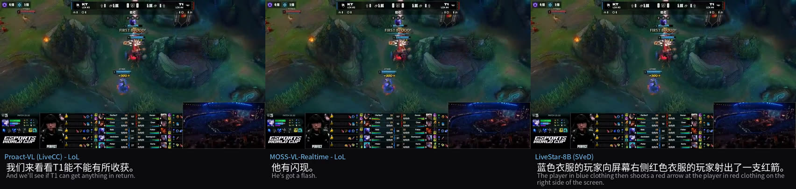

# 01 · 调研：现成的实时解说模型，能不能直接当教练用

> **一句话**：AI 教练几乎没有公开了方法的研究，但“看着画面、自己决定什么时候开口”这个核心问题，实时解说模型已经在做。我拿三个现成的实时解说模型（Proact-VL、MOSS-VL-Realtime、LiveStar）的官方权重在和平精英上测：**三个都不能直接用于长时间的和平精英**，根子是一件事 —— **“什么时候开口”藏在模型内部**，外面调不动、复现不了、出了错查不到为什么。这推出了后面所有设计的第一条：把“何时说”拿到模型外面来管。

**口径**：本篇的数字来自当时的实验记录。实验素材里的和平精英录像属于内部数据，不随仓库公开；公开的只有 LoL 官方 demo 片段上三个模型的解说成品（[`demo/research/`](../demo/research/)）。

---

## 0. 要做的事，和这个游戏的特点

**目标**：做一个和平精英的 AI 教练 —— 玩家打游戏时，它**只看屏幕画面**（不接游戏内部数据），自己判断什么时候该提醒，说一句玩家能马上照做的话。

| 和平精英的特点 | 对 AI 教练意味着什么 |
|---|---|
| 一百人跳伞、搜物资、跑毒（安全区不断缩小），活到最后的队伍获胜；常玩四人组队 | 要站在**队伍**视角：队友在哪、状态如何、谁在打谁 |
| 一局十几到三十分钟，事件稀疏又扎堆 —— 实测一局 14.7 分钟的录像，前 8.5 分钟只有跳伞、搜物资、吃药，战斗全挤在后 6 分钟 | **大部分时间该闭嘴**，一出事又要几秒内开口 |
| 关键信息都是屏幕角落的小数字、小图标：血量、护甲耐久、弹药、队友状态、安全区距离和倒计时、击杀播报、剩余人数 | 教练的“事实”得先从仪表盘上**读准**，读错一个数就是瞎指挥 |
| 打不打、往哪走，取决于圈的位置、地形和掩体 | 光读数字不够，还得**看懂画面** |
| 开局有几秒纯黑 / 加载，还有结算、回放这类非对局画面 | 先要分清“现在是不是在打” |

教练比解说多三条必须做到的要求：**说的事实能核对、真的看得懂画面、一两秒内说出来**。

## 1. 为什么先从“解说”入手

AI 教练这个方向，**公开了方法的研究几乎没有；产品不少，但做法都没公开**：

| 类型 | 例子 | 看什么 | 何时开口 |
|---|---|---|---|
| 玩家问了才答 | Hakko AI | 屏幕画面 | 玩家问才答，7–10 秒 |
| 读游戏官方数据 + 固定规则提醒 | Mobalytics、Blitz.gg（LoL）、Trophi.ai（赛车） | 官方局内数据 / 遥测 | 计时器、阈值、固定节点 |
| 纯看画面、大模型实时点评 | Questie AI（PUBG 等） | 屏幕画面 | 大模型自己挑时机（机制没公开） |
| AI 队友，不是教练 | KRAFTON × NVIDIA 的 PUBG Ally；GDC 2025 上的对话式 AI 队友 | 游戏内状态 + 玩家语音 | 玩家下指令 → 回应 |
| 赛后复盘 | Omnicoach 一类 | 赛后录像 | 打完再分析 |
| 学术 | CHI PLAY'21 的 Apex “AI Coach” | 遥测数据 | 找最该提升的属性给建议 |

> 我一开始写的是“这个组合几乎没有人做”，第二轮核实查到 Questie AI 官网写明“看你的屏幕、像朋友一样实时语音聊”，于是更正为：**只看画面 + 实时开口有人在做，只是怎么决定何时开口都没公开，没法直接对照**。

而实时看视频、自己决定何时开口的**公开模型**，几乎都做在 AI 解说上。解说和教练的核心问题一样 —— 看着连续画面，自己决定什么时候开口、开口说什么；区别在目标：解说越热闹越好，说错一句是瑕疵；**教练大部分时间该沉默，说错就是有害**。所以先把解说当调研入口，看它们的“开口机制”能不能直接拿来用。

**为什么不训练、直接拿官方权重测**：从原始模型出发，才能看清方法本身会出什么问题，并反推它训练上的局限（比如训练片段只有 36 秒）。如果是方法固有的问题，说明这个方向本身不适配，不必再往下走。

## 2. 三个模型

测的顺序：先测最贴合的 Proact-VL（专做游戏解说）；它暴露出两个毛病 —— 只见过 36 秒的短片、开口状态会锁死 —— 于是去测训练窗口长得多的 MOSS-VL，和卖点正对这两个毛病的 LiveStar。

|  | Proact-VL | MOSS-VL-Realtime | LiveStar / Pro |
|---|---|---|---|
| 为什么测 | 专做游戏解说，自带屏幕共享实时解说 demo | 训练窗口约 12.8 分钟，验证“片子够长是不是就行” | 卖点正对 Proact-VL 的锁死和短片 |
| 怎么决定开口 | `<\|FLAG\|>` 位算 0–1 开口分数，过阈值（写死 0.5）才说；不说时往上下文写 `<\|SILENCE\|>` | 每帧一个决策位，像生成普通字一样选 `<\|silence\|>` 或 `<\|response\|>`+文字 | 不学符号：拿**上一句已经说出口的话**对照新画面算困惑度，涨过阈值才开口 |
| 训练 / 评测片段多长 | 实测官方 128,000 条训练标注：中位 36 秒，最长 60 秒 | 论文：训练窗口最长约 12.8 分钟 | 公开评测集实测中位 14.3 秒；长时分区没发布 |
| 和平精英上 | 80 秒片段：报出的数字命中真实画面的概率是随机的 **12.3 倍**，但**击杀归属会错** | 同一段 80 秒：六次中文解说报了 291 个数字，命中率**和瞎猜分不开** | 14.7 分钟长片：全程**没认出是游戏**，击杀召回 **0/18** |

### Proact-VL：三个里唯一在“读屏”，但长片必然锁死

- 官方三步全跑通（快速推理 → 网页 demo → 屏幕共享实时解说），**没改推理逻辑**；自己加了中文字幕和中文语音。LoL / CS 直播画面上跑了 7 个实时会话，外加一次 30 分钟、3,942 步的长跑。
- **锁死**：读代码找到原因 —— 不说话的那一秒会把 `<|SILENCE|>` 写进 KV cache（`assistant.py:259`），沉默越久越想继续沉默，说话同理。长跑里最长连说 918 步（约 15 分钟）、连默 267 步；满屏交战时分数稳定在 0.14–0.29，就是不开口。
- **复读**：0%–73.5%，有四种形式（整句照抄、A-B-A-B 循环、换说法讲同一件事、句式模板），**最初的指标只测得到第一种**。
- **尺度**：一局 10–30 分钟，模型见过的最长上下文 60 秒。
- **边界**：官方按 30 秒切段评测，我没按官方协议跑 LiveGamingBenchmark。所以结论是“不能直接用于长时和平精英”，不是“这篇论文不行”。

### MOSS-VL：训练窗口长，不等于会看

- 为了验证“训练片段够长是不是就行”：它的实时训练窗口约是 Proact-VL 的 21 倍。
- 和 Proact-VL 用**同一段** 80 秒和平精英片段对照；MOSS-VL 能固定随机种子，跑了 3 次配对比较。
- 结果：它没在读屏，而是按“吃鸡解说该长什么样”**编一场自洽的比赛**；报的数字扣掉被提示词污染的那个编号后，命中率和随机猜测无法区分。
- 另一个毛病引出了后面去看 Video2Text：**它不知道自己上一句要念多久**，每帧独立决定说不说，声音能落后画面 6–9 秒。
- 顺手沉淀出“拿权重跑出带配音的解说成品视频”的九步流水线，以及后来一直在用的几把尺：**复读看两个指标、事实和时机分开核对、召回要和随机基线比**。

### LiveStar：开口机制最有意思，但离教练任务远

- 开口机制不学任何“闭嘴”符号，而是看**上一句话还贴不贴新画面**：贴着就不说，贴不上了才说新的 —— 用“旧话过没过时”判断“要不要开口”。`--pro` 模式上游原本会崩，我修了一个 7 行的 attention mask bug 才跑通。
- 为什么在实际中不稳：
  - **第一句错，后面全错**：长片开头 9 秒是纯黑画面，它对着黑屏说了第一句；之后 882 帧的开口判断都拿这句幻觉当基准。
  - **判定余量比噪声还小**：阈值卡在 +0.04%～0.86% 的困惑度变化上，而同一条命令跨进程的数值抖动就有 1.08% —— 半精度计算不逐位一致 → 生成的句子变了 → 基准跟着变。同一条命令跑 4 遍，发言次数在 3 到 5 之间跳。
  - 它更像“画面变了”的检测器，不像“出事了”的识别器【推断：遮挡对照做过，但不干净】。
- 14.7 分钟长片的击杀真值是我逐条读播报做的（11 次淘汰 + 7 次击倒），召回和“把发言时刻随机平移”的零假设比。满负荷那次，8-gram 复读率 91.6%。
- 为什么离我们远：它的长时记忆是为“回头问它十分钟前发生了什么”设计的；教练要的是把**眼下**的状态读准、及时开口。

### 同一段公开片段上，三个模型各说了什么

LoL 官方 demo 片段（Proact-VL 仓库自带素材，KT vs T1，30 秒），第 20 秒画面正中是 “FIRST BLOOD!”：

完整成品（原片 + 模型解说 + 中英字幕 + TTS 配音）：[Proact-VL](../demo/research/lol_proactvl.mp4) · [MOSS-VL](../demo/research/lol_mossvl.mp4) · [LiveStar](../demo/research/lol_livestar.mp4)。LiveStar 那段第 5、6 句一字不差地重复，成品比原片长 2 秒 —— 文本塞不进时间轴，本身就是复读的证据。

## 3. 调研完发现的问题：为什么对和平精英不适配

三个模型各有各的坏法，归结起来是一件事：**“什么时候开口”藏在模型内部**。而一局和平精英又长、大部分时间没事、信息又都在小图标里，正好踩中它们所有弱点。

| 问题 | 证据 | 对教练意味着什么 |
|---|---|---|
| 开口机制在模型内部，管不住 | Proact-VL 最长连说 918 步、连默 267 步；LiveStar 同一命令发言次数 3–5 次跳 | 该说的时候必须说，不能靠调阈值碰运气 |
| 只见过短片 | Proact-VL 训练 ≤60 秒；LiveStar 公开评测中位 14.3 秒 | 一局 10–30 分钟、前半程几乎没事，完全在它们见过的范围之外 |
| 看不懂和平精英画面 | MOSS-VL 数字靠编；LiveStar 全片没认出是游戏；Proact-VL 读得准但归属会错 | 教练每句话都要有真事实撑着 |
| 复读 | Proact-VL 0%–73.5%；LiveStar 最高 91.6% | 玩家听两遍就会关掉 |
| 不知道自己上一句要念多久 | MOSS-VL 声音能落后画面 6–9 秒 | 提醒晚几秒就没用了 |

> [!NOTE]
> **边界**：没按官方协议跑基准，三个模型也没在同一份素材、同一套真值上做三方对照。结论是“不能直接用于长时和平精英教练”，不是对这些论文本身的评价。

**所以下一步**：既然毛病出在“何时说”被关在模型里，就想办法把它拿到模型外面来管 —— 这就是去看 Video2Text 的原因（[02](02_video2text_and_qwen.md)）。

## 4. 评测时沉淀下来的几把尺（后面一直在用）

- **复读看两个指标**：逐字重复 + 语义重复。只看逐字会漏掉“换个说法讲同一件事”；我自己第一版的逐字尺漏计过，被跨会话核对推翻过一条结论。
- **事实和时机分开核对**：说对了没有、说得及时没有，是两件事。
- **召回要和随机零假设比**：开口一密，随便撒也能撞上事件。有一次 7/7 看着满分，同样次数随机撒平均就有 6.2 个、撒到 7 个的概率 36% —— 那次不算数。
- **跑完先自检**：跑废的和跑完的长得一样（退出码 0、文件齐全），要自己查。
- **跨进程可重复性**：同一条命令多进程重跑，差异比判定余量还大时，单次 run 的 A/B 不作数。
