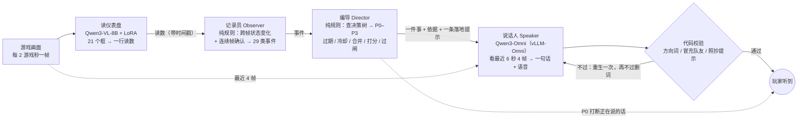

# 04 · 三层教练框架：记录员 → 编导 → 说话人

> **一句话**：把屏幕上读到的东西，实时对上一棵人写的决策树里的某一条，再让模型用一句人话讲出来。**规则决定什么时候说、先说哪件；模型只把这一件事说成一句话；代码再核对说得对不对。**

复现本篇的数字：`python analysis/reproduce.py rules speaker live`

---

## 1. 架构



用电视直播打个比方：

| 角色 | 干什么 | 用不用 AI |
|---|---|---|
| **读仪表盘**（HUD Perception） | 把屏幕角落的小数字、小图标读成一行结构化读数 | 用：自己训的 VL 模型（[06](06_hud_perception.md)） |
| **记录员**（Observer） | 盯着读数，把跳动的数字变成一件件“事”（血一下掉了一截、人在圈外来不及了） | 不用，纯规则 |
| **编导**（Director） | 查表：这件事挂在决策树哪一条、有多急；再决定现在说不说、先说哪件、要不要打断 | 不用，纯规则 |
| **说话人**（Speaker） | 拿到编导定好的那一件事，看最近几帧画面，说成一句能马上照做的话 | 用：Qwen3-Omni |
| **校对** | 说出口前核对：方向词有没有依据、有没有冒充队友、有没有念出提示原文 | 不用 |

**为什么前两层不用 AI**：“圈外还有 1,500 米、已经开始缩圈”和“队友刚拿了个人头”哪个更急，不需要推理。规则算得准、算得快、能一条条复查 —— 五场 148 分钟的整场离线回放几秒跑完、一分钱不花，还能随时整场重跑做对比。**AI 只做它不可替代的事：看画面、组织语言。**

## 2. 这个框架是怎么一步步搭出来的

### 底座：一棵人写的决策树

不让 AI 自由发挥，每句话都要挂在一棵固定的决策树上。这棵树来自同事整理的一份对局决策框架（原件不公开）：把老手打这个游戏时脑子里的判断顺序，写成局势、资源与状态、走位、交战四块下面一条条“该问自己的问题”。规则实际挂上了其中 38 条，[`coach/knowledge/decision_tree.md`](../coach/knowledge/decision_tree.md) 里是这 38 条的转述，例如“走位 / 找掩体 → 最近的掩体”“资源与状态 / 时机安不安全 → 现在能不能打药”“局势 / 队友状况 → 谁在打”。

> [!IMPORTANT]
> **铁律：系统说出来的每一句话，都必须挂在这棵树的某一条决策项下面。** 挂不上的不许说；代码里写错一个决策项的名字，加载时直接报错（`coach/framework.py::check_route`）。它不是不让 AI 说话，是不让 AI 自己决定说什么话题。

### 第一步：先有数据 —— 还没有识别模型时，先把 8 场完整对局标成逐帧读数

规则要吃结构化的读数，而和平精英的仪表盘没有现成的识别器。与其先训模型，不如先把几场完整对局的读数标准 —— 框架可以先搭起来、离线整场跑，识别模型以后再换进来。

- **素材**：对局录像 62 场、合计 11.6 小时。先挑 8 场完整对局（P1–P8，从开局一直打到吃鸡）。
- **先标框**：自己写了个浏览器标注页，在画面上拖出仪表盘每个元素的位置，定成 21 个框（[`perception/rois_v2.json`](../perception/rois_v2.json)）。
- **多路独立读数**：OCR + 像素规则（数字类）、本地 VLM（Qwen3-VL）等几路互相对照；武器、物资这类图标用参考图库做剪影匹配。
- **读时钟对齐**：右下角的对局计时器每帧都在，读它就拿到“游戏第几秒” —— 录像其实是 2 倍速、中间还有定格，靠它才对得齐。
- **数值别信单帧**：把前后几帧拿出来核对，取中位数、去掉不可能的跳变。
- **人审**：8 场逐帧人工核对，得到 6,939 帧；其余 54 场只有机器粗标。
- **null 也是信息**：`zone_dist_m` 为 null 表示屏幕上此刻没显示圈距 —— 人在圈内，不是“没读出来”。

### 第二步：中间加一层编导，三层拍板（09-02）

冲着第二段尝试暴露的三个问题（[03 §3](03_decision_and_early_attempts.md#3-第二段尝试先找底座跑通记录员--说话人08-31--09-01)）：

- **记录员不用模型**：输入是逐帧读数，事件全由规则从时序算（血两帧差、倒地列表从空变非空、上下车跳变）；一类事一条规则
- **编导也不用模型**：纯规则 + 一张表（事件 → 决策项 → 档位 → 冷却）；**事件进候选池带有效期、丢了记账** —— “悄悄丢”解决了；**冷却和间隔在触发层就把重复压掉**
- **说话人用模型**：只拿编导定好的那一件事去说

验证方式：**离线整场回放**（几秒跑完，渲染成带字幕和语音的视频）+ **审片页**（视频 + 可点的时间轴 + 每句话的决策卡片；逐句标“这句不对”，再用追溯脚本查这句话是哪条规则、哪个读数触发的）。

### 第三步：边用边修（09-02 → 09-04）

规则迭代都在一条主线上做；看画面、听声音、换模型、接识别模型这些探索复制出去做，主线不受影响：

| 分支 | 做什么 | 结果 |
|---|---|---|
| 主线 | 知识库进代码、意图间隔、护栏和校验 | 最终版 |
| 视觉 | 给教练加一层“看”：问画面 12 个是 / 否问题 | 只有“室内 / 附近有掩体 / 开阔地”三个能用 |
| 听声辨位 | 从录像音频判断枪声方向 | 做不成：录像音频 8 kbps，有效带宽约 900 Hz |
| 换说话人模型 | 本地 8B / 本地 Omni 对照 | 定为本地 Qwen3-Omni（§4） |
| 接识别模型 | 读数改由自己训的 v7 模型实时给出 | 见 §6 与 [06](06_hud_perception.md) |

边做边踩的坑（挑重要的）：

| 现象 | 原因 | 怎么改 |
|---|---|---|
| 6 秒内连说两三遍“进掩体” | 合并只按话题分组；血低进掩体、开完枪转点、换弹、打药前躲是四个话题，落到玩家身上全是“进掩体” | 加“意图”这一层：同意图 20 秒内只说一次。换了说话人模型，撞车都是 14 对 —— **是结构问题，不是模型问题** |
| 合并后 90 秒没有用药建议 | 压制把“掩体后打药”整条丢了 | **压制一定要配降级通道**：换个标题、只留选药提示 |
| 说“往西北跑”，安全区其实在南边 | 提示词要求说清方向，却没给它方向 | 从小地图读出安全区方位给它；方向词只许来自方位字段或画面里看得见的东西；生成后代码校验，编了就重生，再不行删词 |
| 它把 JSON 念出来了 | 让模型自己填标签 | 标签由编导给，模型只出一句话 |
| 满屏“血太低了” | 提示词里放了示范说法，被原样照抄 | 提示词里不放示例句 |
| “等我扶他” | 提示里写“派一个人去救”，模型代入成了队友 | 告诉它“你不在游戏里”，并用代码拦下冒充队友的话 |
| 队友栏把玩家自己当队友 | 四行里有一行是玩家本人，而且每场行号不同 | 每场单独标出本人那一行 |
| 剩余人数读出 11→1、13→1228 | 识别掉位 | 取中位数 + 队伍存活下界 + 每 2 秒最多少 5 人；吃鸡只在对局结束时判 |
| “掉信号”误报 | 信号值 <1 的帧 85% 其实在圈内 | 看下降，不看绝对值 |
| 血 0 被当成“该打药” | 0 是倒地，不是血低 | 倒地单独成一类事 |
| 跑毒来不来得及算错 | 跑步速度一开始拍的是 5.5 米/秒 | 查资料改成 6.3 米/秒（收枪跑）；1,000 米的距离差 20 多秒 |
| “撞车 0 对”是假的 | 判定窗口 15 秒、间隔设 20 秒，当然是 0 | 评估指标不能依赖被评估的参数 |

> [!TIP]
> **贯穿这一段的一条规律**：规则层拦得住的错，就不该留给模型 —— **数值判定写在事件里，落地写在表里，禁令写在提示词里，校验写在代码里。**

## 3. 最终版：一件事从读数到开口

### 编导每一步在做什么（`coach/director.py`）

```text
新的事进候选池（同一件事只留最新的）
→ 过期了？丢掉，并记账
→ 冷却：同一件事每多说一次，冷却拉长一半（最多 3 倍）；同一个话题至少隔一段（安全区 30 秒、治疗 15 秒……），P0 必须说例外
→ 同意图间隔：“进掩体”类 20 秒、“打药”类 60 秒内只说一次；被拦下的“掩体后打药”降级成“打药”，只留选药提示
→ 同话题合并（其余当成“同一件事的其它角度”带给说话人）
→ 打分 = 档位底分（P0 100 / P1 70 / P2 45 / P3 20）+ 紧急度 + 新鲜度（2 分钟内没说过 +10）− 重复 − 类别均衡
→ 过闸：现在说不说
```

| 档 | 人话 | 例子 | 说不出来的时候 |
|---|---|---|---|
| P0 | 再不做就要死了 | 圈外来不及、掉信号、血低还在掉 | **打断**正在说的话（正在说的也是 P0 就等它说完） |
| P1 | 这一枪这一步怎么办 | 掩体后打药、换弹、队友倒地、支援、圈边 | **排队**等空闲 ≥2 秒，过了有效期也会丢 |
| P2 | 可以更好，但不着急 | 规划进圈、备弹、护具、标记、载具、开枪后转点 | 空闲 ≥6 秒且没有更急的才说，**过期作废** |
| P3 | 陪着你 | 夸赞、进圈了、趁空补满血 | 空闲 ≥12 秒、池里没更急的才说，**忙就丢** |

29 类事件、每一类的触发条件、阈值、档位、冷却和挂在哪条决策项，全部列在 [05 · 规则明细](05_rules_reference.md)。

### 说话人拿到什么：一张很窄的提示卡（最小上下文）

- **给**：要说的那件事和档位、挂在决策树哪一条、依据（来自仪表盘）、一条落地提示（哪些要看画面补）、一行当前状态、**最近说过的三句话**、**最近 6 秒的 4 张画面**（每张标着相对时间）
- **不给**：整局历史、编导淘汰掉的候选、其它读数
- **不许**：换话题、编画面里没有的东西、复述玩家自己看得见的数字

这张卡的长度和整局时长无关 —— 第 30 分钟和第 1 分钟一样短，所以说话人的延迟不会随对局变长而上涨。

### 一句真实的话是怎么出来的（P1 对局第 785 秒，离线回放版）

| 环节 | 发生了什么 |
|---|---|
| 仪表盘读数 | 血从 100% 一下掉到 10% |
| 记录员 | 判成一件事：血一下掉了很多 |
| 编导查表 | 挂「走位 / 找掩体 → 最近的掩体」；P0，必须说 |
| 给说话人的提示 | 先半句安慰，再指出画面里最近的掩体方向；受击方向标识在屏幕哪边，敌人就在哪边 |
| 说话人第一句 | “快进左边那栋绿屋！” |
| 代码校验 | 打回：“左边”没有画面里看得见的东西撑着 |
| 重生后说出口 | “左边绿屋门口有矮墙，快贴上去！”（2.8 秒） |

分工看得很清楚：“要找掩体、这是最急的”是规则算的；“绿屋门口有矮墙”只能靠看画面；“左边”有没有依据是代码查的。**同一刻在真流式实跑里没有这层校验，说话人复读了上一句 —— 见 §6。**

### 提示词写长了，模型会不会更不听话？（09-04 A/B）

我怀疑说话人的 system prompt 从 475 字长到 1,307 字，导致它不遵守“不要同一个开头”这类指令。做了只差一个变量的对照（同模型、同编导、同五场，只换 system prompt）：

| 五场合计 210 句 | 短 475 字 | 长 1,307 字 |
|---|---|---|
| 相邻两句同开头 | 3 | 4 |
| 方向词校验介入 | 16 | 6 |
| 自称队友（我去 / 等我） | 4 | 0 |
| 念百分数 / 米数 | 1 | 0 |

**结论**：开头重复和长短无关；长 prompt 里的护栏实实在在拦住了乱说方向和“我去扶”。开头重复的根子在**依据的措辞** —— 同一个依据反复喂（“车停太显眼”），模型就反复用同一个开头；要治得在依据层轮换说法。

## 4. 谁来说话：全本地 1.1 秒一句

| 版本 | 文字 | 语音 | 每句耗时 |
|---|---|---|---|
| 文字模型 + 独立配音 | 本地 Qwen3-VL-8B（vLLM） | 另走 TTS | 0.3 s + 配音 |
| Omni（transformers） | Qwen3-Omni thinker | Qwen3-Omni talker | 约 10–13.5 s |
| **Omni（vLLM-Omni）** | **Qwen3-Omni thinker** | **Qwen3-Omni talker** | **约 1.1 s** |

vLLM-Omni 这条路一开始判断“装不上”（新版本线要 CUDA 13 / 驱动 ≥580），后来找到 0.18.0 这条线对齐 vLLM 0.18、在驱动 535 下能跑：两张卡（thinker 一张，talker + code2wav 一张），OpenAI 兼容协议 `modalities: ["text", "audio"]`，流式语音块在 `delta.content` 里（[`tools/serve_vllm_omni.sh`](../tools/serve_vllm_omni.sh)）。

**五场四排（P1 / P5 / P6 / P7 / P8）全本地实测：210 句，0 失败、0 缺语音，每句（含语音）中位 1.10 s、p90 1.31 s**（`data/coach/speaker_local/`）。

<details>
<summary>为什么没换成“文字模型 + 独立 TTS”</summary>

Omni 的 talker 会让音色每句轻微漂移（生成式解码器每次重采样说话人特征）。同样 4 句对照：thinker 0.2 s + Kokoro-82M 首音频约 0.25 s；thinker + Qwen3-TTS-0.6B 走 vLLM-Omni 流式，首块约 0.3 s、音色固定；talker 整句 0.7–1.3 s。**talker 的问题是音色不是延迟**，最后决定语音链路维持 thinker + talker，本地 TTS 的数据留作备选。测 TTS 要注意：同一句流式生成 6 次时长 4.32–5.60 s（sd≈10%），单次采样比较会得出反的结论。
</details>

## 5. 最终规则跑五场：事件 → 开口

最终版规则 × 人审读数，五场四排整场离线回放（不调任何模型，`data/coach/offline_final/`）：

| 场 | 分钟 | 事件 | 开口 | 次/分 | P0 | P1 | P2 | P3 | P0 打断 | 过期丢弃 |
|---|---|---|---|---|---|---|---|---|---|---|
| P1 | 30.0 | 156 | 42 | 1.40 | 1 | 10 | 15 | 16 | 0 | 40 |
| P5 | 28.9 | 175 | 49 | 1.69 | 4 | 11 | 20 | 14 | 2 | 50 |
| P6 | 30.6 | 118 | 45 | 1.47 | 0 | 11 | 21 | 13 | 0 | 36 |
| P7 | 29.3 | 126 | 41 | 1.40 | 1 | 5 | 20 | 15 | 0 | 35 |
| P8 | 29.3 | 128 | 39 | 1.33 | 3 | 14 | 9 | 13 | 0 | 37 |
| **合计** | **148** | **703** | **216** | **1.46** | **9** | **51** | **85** | **71** | **2** | **198** |

- 平均 **3.3 件事才说 1 句**，每分钟 1.46 句；“P0 必须说”全场只有 9 句
- **过期丢弃 198 条、同意图间隔拦下 76 次、P3 忙时丢 22 条，全部记账** —— “悄悄丢”这个问题从结构上没了
- 这些是**规则层**的数；“说得对不对、有没有用”要另外评（见 [07](07_limitations.md)）

## 6. 真流式整场：接上自己训的读仪表盘模型（P1，墙钟 30 分钟）

之前的回放都用人审读数，等于“零延迟、全对”的感知。这一场改为**真实上线的形态**：画面按真实节奏每 2 秒到一帧，v7 感知模型逐帧读数（vLLM 常驻，1 张 H20），规则层实时判事件和决策，说话人（Qwen3-Omni，vLLM-Omni，另 2 张卡）出句子和语音，三者同机并发，所有延迟实测（[`tools/replay_live.py`](../tools/replay_live.py)，数据 `data/coach/live_P1/`）。

| | 数 |
|---|---|
| 帧 / 事件 / 开口 | 880 帧，150 个事件，38 句（P0 1 / P1 9 / P2 15 / P3 13） |
| 说话人忙而丢弃 / 失败 | 0 / 0 |
| 感知每帧 | 中位 1.22 s、p90 1.26 s（和说话人抢 CPU / IO；单卡独占时 0.93 s） |
| 规则决策 | < 1 ms |
| 说话人首个语音块 | 中位 1.04 s |
| **画面到达 → 玩家听到** | **中位 2.29 s，最大 2.64 s** |
| 掉队（帧到了没按时开始处理 > 0.5 s） | 2 / 880 帧（开头预热） |

感知有了延迟之后，三件事必须显式处理（[`coach/live_provider.py`](../coach/live_provider.py)）：

1. **读数上的游戏时间就是那一帧的时间**，当时间戳用，不校正、不外推；每条读数带“已经过去几秒”，面板要显示“现在”自己加。直接拿它当现在，会稳定慢约 1 秒。
2. **队列满了丢最旧的帧，不排队**：排队会让延迟越积越大，最后显示的是几十秒前的战况；丢帧只丢中间过程，丢了多少记账。
3. **击杀横幅、击杀播报、队友消息不沿用上一帧**：沿用等于把同一个击杀再播一遍；其它字段读不出时沿用并打标记。

逐句审读这 38 句，发现两处明确的错（在 [demo](../demo/index.html) 的卡片上原样标出）：

- **第 15 句（785 秒，全场唯一的 P0）**：血从 100% 掉到 11%，该说“找掩体”，说话人却把上一句“刚打完一枪，赶紧往左转移位置。”原样复读了。句子里的“往左”没有可见物撑着，**离线版的方向词校验会把它打回**（`tests/test_coach.py` 里有这条用例），但**实跑链路还没接上生成后校验**；“和上一句一字不差”则是现有三道校验都管不到的。同一刻离线版说的是“左边绿屋门口有矮墙，快贴上去！”（§3）。
- **第 34 句（1531 秒）**：依据是“只剩 1 人”，来自剩余人数读数；这一段读数一直是 1，但对局之后又打了 4 分半钟，真实人数不可能是 1 —— 多半是 11 被读掉了一位。**识别错会直接变成说错话。**

> [!NOTE]
> P1 在读仪表盘模型的训练集里，这场的读数比真实上线时更准；留出场 P8 上 21 个字段平均 0.952。接上模型读数以后的**多场端到端评测还没做** —— 规则层五场的结论用的都是人审读数。

## 7. 一个整理仓库时才发现的 bug

写单测时发现编导第 4b 步“同一步内的同意图合并”条件写错了（`ci not in INTENT` —— 拿意图名去查动作表，恒为真），**这一步从来没合并过**；真正在起作用的是第 3 步的“同意图间隔”（五场里拦下 76 次）。我在临时副本里修掉后重跑五场：**开口数完全不变（216 → 216）**，只有 4 句会在提示里多带一条“同一件事的其它角度”。仓库里的代码和数据保持原样（数据就是这版跑出来的），在 bug 处加了注释，单测里这条标成 `expectedFailure`。

## 8. 别人有没有用类似的方法

有，而且不少。“先用规则或事件决定说哪件、再让模型组织语言”在游戏台词系统、体育解说、驾驶舱告警、主动式助手的研究里都能找到 —— 这是一个反复被验证过的思路。

| 名称 | 领域 | 像在哪 | 不一样在哪 |
|---|---|---|---|
| Valve《求生之路》等的动态台词（GDC 2012） | 游戏台词 | 事件触发一次查询，按条件去规则库挑最匹配的一条；记住的事实带时间，防止反复说 | 台词是编剧预先写好的，不生成也不用校验 |
| 游戏 NPC 随口台词系统 | 游戏 | 每条台词有优先级，高优先级不被低优先级打断，有冷却 | 预写文本 |
| PUBG Ally（KRAFTON × NVIDIA） | 游戏 AI 队友 | 快反应的行为树 + 慢思考的语言模型，两层分工 | 读游戏内部数据；没公开事后校验 |
| IBM watsonx 温网 / 大师赛解说 | 体育转播 | 先用信号挑出值得说的时刻，再让大模型基于赛事数据写解说 | 离线出片，不需要打断 |
| 经典数据到文本生成 | 学术 | “说什么”和“怎么说”分开，是这个分工的学术原型 | 一次生成一段，不处理说到一半被打断 |
| 《主动式 agent 真的需要大模型决定何时开口吗？》（arXiv 2605.30152） | 学术 | 用轻量模型决定何时触发，大模型只负责把信息说成一句话 | 触发用的是学出来的轻量模型，不是人写的规则 |
| 飞机驾驶舱告警（FAA） | 航空 | 警告 > 警戒 > 提示三级，高级抢占低级、特定情况抑制 —— 和 P0 打断、过期作废是同一类思想 | 固定文本 |

调研范围内**没找到先例的组合**（“没找到”不等于“没有”）：只看屏幕、自己训模型读仪表盘当感知入口；每句话必须挂在一棵人写的决策树上，挂不上不许说；生成之后用代码核对方向词、身份、有没有照抄提示，再决定重生还是删词。

打个比方：像游戏里的动态台词系统 + 驾驶舱告警分级 —— 规则挑事、定优先级、定谁能打断谁；比方不成立的地方是它们说的都是预先写好的话，这里的说话人要现场生成，所以多了“看画面补细节”和“生成后校验”两步。
