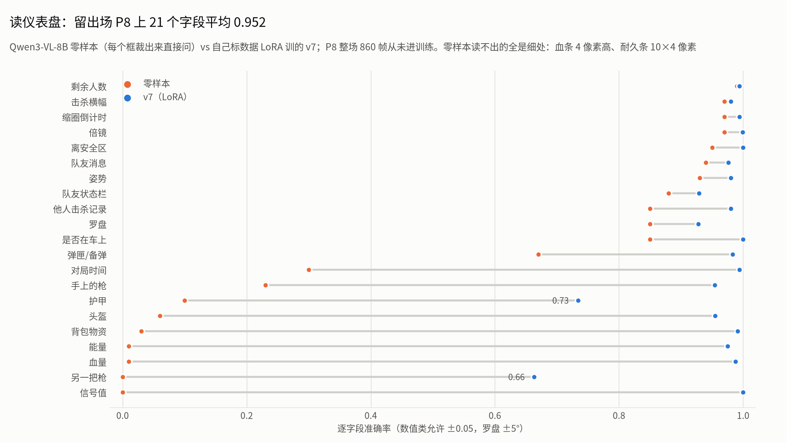
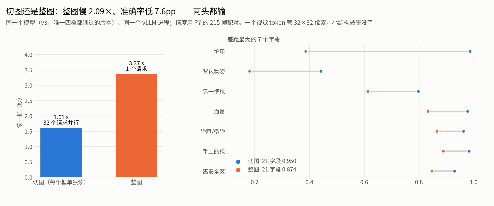
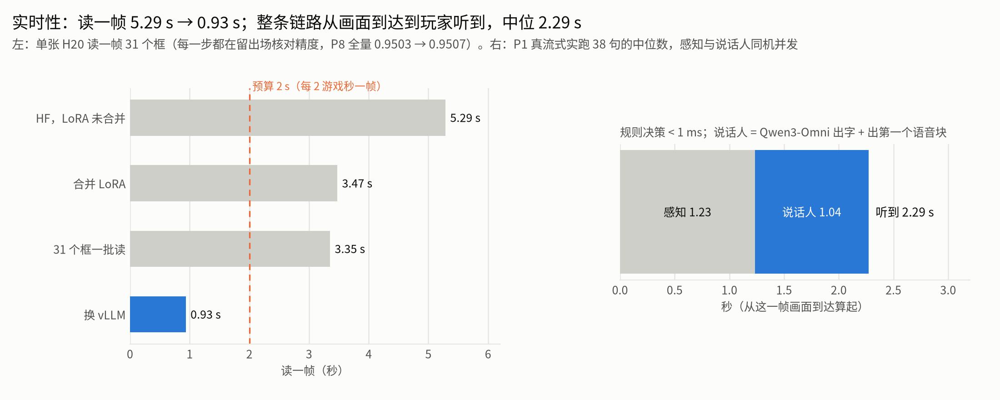

# 06 · 读仪表盘的模型：训练、提速、切图 vs 整图

> **一句话**：通用视觉模型读不出屏幕角落的细处（零样本血量 0.01），仪表盘又没有现成的识别器，所以用自己标的数据训了一个 **Qwen3-VL-8B + LoRA**：人审 6 场 **5,209 帧** + 粗标 **54 场**，在**从未进训练的留出场 P8** 上 21 个字段平均 **0.952**；只训“每个框单独裁小图读”，比整图读**快 2.09 倍、准 7.6pp**；读一帧从 5.29 秒压到 **0.93 秒**（单卡 H20），接进教练的实时链路。

复现本篇的数字：`python analysis/reproduce.py perception`（数据在 [`data/perception/`](../data/perception/)）

---

## 1. 任务：一帧画面 → 一行读数

21 个框（[`perception/rois_v2.json`](../perception/rois_v2.json)），一帧要读 31 个字段（背包物资拆成 11 格单独读）：

```text
{ "game_t": 1137, "alive": 17, "hp": 0.625, "signal": 1.0, "energy": 0.0,
  "zone_dist_m": 677, "zone_countdown": "01:12", "in_vehicle": false, "stance": "站",
  "weapon_main": "GROZA", "ammo_mag": 41, "ammo_reserve": 367,
  "helmet": 3, "armor": 3, "helmet_dur_pct": 0.904,
  "supplies": {"firstaid": 3, "painkiller": 3, "drink": 5, "bandage": 8, "frag": 1, "smoke": 1},
  "team_panel": {"danger": [1], "downed": []}, "killfeed": ["玩家40 玩家10", "玩家20 玩家40"], ... }
```

**评估**：逐字段准确率（数值类允许 ±0.05，罗盘 ±5°，文本类逐字比）；**帧全对率** = 一帧里所有字段都对。**P8 和 P4 两场完全不进训练**；v4、v5 训练时见过 P4，所以**跨版本只比 P8 全部 860 帧**，而且 v4–v7 用的是同一批（09-05 修标后的）标签。

## 2. 零样本基线：先看哪些本来就会（09-03）

Qwen3-VL-8B 不训练，按 21 个框把画面裁成小图、放大 3 倍逐个问，在 8 场人审数据上跑了 73,913 条：

- **已经够用（≥0.95）**：剩余人数 0.97、缩圈倒计时 0.98、击杀横幅 0.97、倍镜 0.96、姿势 0.96、队伍面板 0.96
- **基本不会（<0.35）**：血量 0.01、信号 0.01、能量 0.02、头盔 / 护甲耐久 0.07、物资 0.03、主武器 0.30、副武器 0.07、对局时间 0.31

错在哪一类，决定训不训得动：对局时间是读得出“11:21”、换算成秒算错（语义问题，训得动）；头盔 / 护甲等级 0.98 全对、耐久满格时回空而不是 1.0（口径问题，训得动）；血量、信号直接回 0 或空，读不出条的填充比例（真不会）；武器几乎全读成 M416 / AKM。**“要不要训”从争论变成了事实，训练预算该花在这 8 个字段上。**

## 3. v1 → v7：版本总表

| 版本 | 时间 | 改了什么 | 训练 | 留出场结果 |
|---|---|---|---|---|
| 零样本 | 09-03 | 不训，先看哪些本来就会 | — | 6 个字段 ≥0.95；8 个 <0.35 |
| v1 | 09-03 | 第一版 LoRA（r=16，只挂语言部分，4,365 万参数、占 0.495%，视觉编码器冻结） | 人审 5 场、44,496 条；4 卡 91 分钟 | 血量 0.969、信号 0.969；主 / 副武器 0.607 / 0.084 |
| v2 | 09-03 → 04 | 粗标 54 场补枪谱（主武器 51 种枪）；物资拆 11 格 | 51,294 条；2 卡 3.7 小时 | 主 / 副武器 0.814 / 0.331 |
| v3 | 09-04 | 单框 / 小块 / 区域 / 整帧四档混训 | 8 卡 2,400 步 4.35 小时 | 单框 0.913 最准最快，整帧 0.845 → **以后只训单框**（§5） |
| v4 | 09-04 → 05 | 只训单框 + 字段抽样 + 结构约束过滤 | 8 卡 1,600 步 1 小时 47 分 | P8 0.9290；护甲 0.529 |
| v5 | 09-05 | 武器提示词 A/B/C 后改中性提示；粗标占比 0.35 | 8 卡 2,400 步 | P8 0.9330；主武器 0.959 |
| v6 | 09-05 | 训练预算改成按「还差多少」分配 | 8 卡 2,400 步 | P8 0.9355；护甲 0.736 |
| **v7** | 09-07 | 预算再分一次；按字段定裁剪倍数 | 人审 6 场 **5,209 帧** + 粗标 **54 场 28,757 帧**；8 卡 4,000 步约 3 小时 | **P8 0.9523、帧全对 44.4%** |

<picture>
  <source media="(prefers-color-scheme: dark)" srcset="../assets/fig_perception_dark.png">
  
</picture>

### 几个关键的决定

**v1 → v2：错在“没见过”**。v1 按训练集里见没见过分桶：见过 100 条以上的枪 0.90–0.94，没见过的（UMP45、P90、迫击炮……）**0.00**，全往训练集里最多的那把枪上靠。所以 v2 从粗标 54 场补枪谱。代价：只有 2 张卡，取帧从每 4 秒改成每 6 秒，整格物资从 0.846 掉到 0.733。模型比标签对的地方，还反过来抓出几处标签错（圈距丢了千位：画面 1,951m 标成 951）。

**v5：武器两个框的差距，是提示词造出来的**（只训武器、600 步，其余都相同）：

| 做法 | 主武器 | 副武器 |
|---|---|---|
| A 两个框同一句提示 | 0.685 | 0.183 |
| B 两个框各一句（原来的写法） | 0.539 | 0.362 |
| C 不给提示，答案只写枪名 | 0.437 | 0.440 |

不给提示时两个框持平，说明槽位差距主要来自提示词里的导向描述（模型靠“这个框常出现哪几把枪”答题）。之后两个框改用同一句中性提示。三个做法的绝对值都低于混训 —— **武器受益于和其他字段共享的识别能力，单独训是亏的**。

**v6：本阶段最贵的一个设计错误 —— 权重公式**。原来按出现频次的倒数开方加权。护甲每一帧都有值 → 频次最高 → 权重最低：训练块数从 11,900 掉到 3,047，同时 57% 的算力喂给了已经饱和的字段。先定判据：**几个版本预测一致率高（≥90%）= 标签错，加权没用；一致率低（<30%）= 模型错，加权有用**（弹匣一致率 97% → 标签错；护甲 4% → 模型错）。改成按“还差多少”加权，护甲耐久 0.529 → 0.736；副作用是主武器权重砍过头，0.959 → 0.777（v7 补回）。

**v7：按还差多少再分一次预算**。护甲 12%、副武器 12%、主武器 8%、队伍面板 5%、能量 3%，其余字段各留 2% 防止忘掉（[`data/perception/train_pool_v7.json`](../data/perception/train_pool_v7.json)）。训练前先定了每个框的放大倍数（25 个字段 ×1、3 个 ×2、3 个 ×3），用 v6 在 P8、P4 各 120 帧上交叉验证，**两场都不掉超过 0.02 才降档** —— 头盔只看 P8 会以为能 ×1，在 P4 上却会掉 0.40。**同一份 v7 权重，推理时要是还按老口径全部 ×3 裁，平均掉到 0.9431，损失几乎全在主武器（0.954 → 0.793）** —— 服务端裁剪必须与训练一致。

| P8 全部 860 帧 | v4 | v5 | v6 | **v7** |
|---|---|---|---|---|
| 21 字段平均 | 0.9290 | 0.9330 | 0.9355 | **0.9523** |
| 帧全对率 | 25.2% | 28.3% | 30.1% | **44.4%** |
| 护甲 | 0.529 | 0.516 | 0.736 | 0.734 |
| 主武器 | 0.894 | 0.959 | 0.777 | 0.954 |
| 副武器 | 0.412 | 0.435 | 0.483 | 0.663 |

> [!WARNING]
> **两个口径提醒**
> - **护甲耐久到头了**：等级两版都是 1.000，失分全在耐久；误差是双峰 —— 71% 在 ±0.01 以内，26% 偏出 0.1 以上。再调配比没用，要回去看那 26% 的像素。所以规则只用“满 / 不满”。
> - **帧全对率由最弱字段主导**：30.1% → 44.4% 是全 21 字段口径，涨分主要在教练不用的弱字段（副武器、护甲耐久）上；**按教练实际用的 18 个字段算，只是 87.5% → 90.0%（+2.5 点）**。报改善要同时给“衡量模型”和“衡量下游价值”两个口径。

## 4. 这几天最值钱的三条判据

- **几个版本预测一致率高 = 标签错，加权没用；一致率低 = 模型错，加权有用。** 训练侧只产可疑清单，写回标签由标注侧看像素来做。
- **统计只能提假设，判定要回到像素。** 两天里靠分布统计外推错过四次（方向盘、两路读数的一致性、配件、一致率）。
- **留出场必须真留出；小验证集会高估。** 96 帧报副武器 0.565，全量 860 帧只有 0.433。

还有一个反过来的例子：有人报“倒地字段在 P8 上从不输出、是死的”，其实是 **P8 这场根本没有真倒地帧**；在有正例的场次上，38 帧已核对的真倒地帧召回 79%、零误报。**判“失效”之前，先确认样本里有本该触发它的正例。**

## 5. 切图还是整图：拿同一个模型对照（09-07）

我一直想要“一整张图直接出全部结果”。v7 定下切图以后，要一个证据证明这个选择有意义。关键是**把模型固定住** —— 只训过切图的 v7 去读整图，慢是因为它不会答，证明不了什么。所以用 **v3**（唯一切图、整图都训过的版本）合并权重，**同一个 vLLM 进程**先后跑两种输入；精度用 P7 的 215 帧配对（[`data/perception/tiers_P7.csv`](../data/perception/tiers_P7.csv)）。

<picture>
  <source media="(prefers-color-scheme: dark)" srcset="../assets/fig_crop_dark.png">
  
</picture>

| 输入方式 | 秒/帧 | 请求数 | 生成 token | 21 字段均值 | 帧全对率 |
|---|---|---|---|---|---|
| **切图**（每个框单独裁小图） | **1.608** | 32 | 396 | **0.950** | **29.8%** |
| 整图 | 3.367 | 1 | 325 | 0.874 | 6.0% |

**整图慢 2.09 倍、准确率低 7.6pp、帧全对只有切图的五分之一 —— 不是拿速度换精度，是两头都输。**

- **为什么整图不准**：整张 2560×1440 的图变成 3,600 个视觉 token，每个 token 管 32×32 像素；血条 4 像素高、护甲耐久条 10×4 像素，被压进一格就没了。差距正好集中在小结构上：护甲 0.986 → 0.386、物资 0.442 → 0.181、副武器 0.798 → 0.613、血量 0.977 → 0.833。
- **为什么只发一个请求反而更慢**：两边输出总量差不多（396 vs 325 token），差在**串行深度** —— 整图一条输出串行 325 步；切图 32 条同时解码，等最长那条约 40 步。
- **换推理框架也成立**：HF 上整图 14.9–17.6 秒、切图 5.3–5.4 秒，慢 2.7–4 倍。线上的 v7 按字段倍数裁，同样 31 个字段只要 0.934 秒，实际差距约 3.6 倍。

## 6. 提速：读一帧从 5.29 秒到 0.93 秒（09-07）

教练每 2 个游戏秒取一帧，**读一帧必须在 2 秒内读完**，否则读数越积越旧。v7 刚训完时单卡读一帧（31 个字段）要 5.29 秒，超了 2.6 倍。

<picture>
  <source media="(prefers-color-scheme: dark)" srcset="../assets/fig_latency_dark.png">
  
</picture>

单张 H20、一帧 31 个字段、每轮换一帧、取 5 轮中位数；**每改一步都拿真值核对精度**：

| 步骤 | 读一帧 | 累计 | 精度怎么核的 |
|---|---|---|---|
| 起点：HF 推理，LoRA 没合并，每批 16 个 | 5.285 s | 1.00× | — |
| 把 LoRA 合并进主权重 | 3.473 s | 1.52× | 60 帧 × 31 字段 = 1,860 条，改前改后 4 条不同，对照真值全部打平 |
| 31 个字段并成一批 | 3.351 s | 1.58× | 同上 |
| **换成 vLLM**（合并后的权重） | **0.934 s** | **5.66×** | P8 全部 860 帧：0.9503 → 0.9507，帧全对 44.4% → 45.3%，没有一个字段差 ≥0.005 |

- **合并为什么值 1.8 秒**：LoRA 挂在 36 层 × 7 个模块上，每往前算一步多做 504 次小矩阵乘；算的量不大，但解码时每步只出一个字，时间几乎全花在这些调用的启动开销上。顺带发现**评测走的是合并版、线上走的是没合并版**，两边不是同一条计算路径，这次统一了。
- **vLLM 为什么省那么多**：原来一批里 52% 的位置是补齐用的空位，vLLM 不补；解码每步 45 毫秒、理论下限约 4 毫秒，差的是逐步调度开销，vLLM 用 CUDA graph 省掉。

试过、没用的（都是实测）：

| 想法 | 结果 |
|---|---|
| 按输出长短拆成两批 | **反而慢**（3.397 秒）：拆开要串行 48 步，一批只要 35 步 —— 解码一步的耗时几乎与批大小无关，瓶颈是读一遍 8B 权重 |
| 前缀缓存 | 重复的系统提示只占输入文字的 19%，而空位占 52%，缓存管不到 |
| 调大批次、限制输出长度 | 只快 1%–8%：输出早就自己结束了 |
| 相邻帧没变就跳过 | 只省约 2%：每 2 个游戏秒才一帧，镜头在动，框里的像素几乎每帧都变 |
| 把提示词砍短 | 删掉 90% 文字反而慢 13%，空提示慢 5.2 倍：提示词在约束输出长度，砍掉模型就多说 |

> [!CAUTION]
> **两个坑**：① **测延迟必须每轮换帧** —— vLLM 默认开前缀缓存，同一帧重复测会整段命中，测出 0.30 秒是假的，真值 0.93 秒。② **vLLM 的引擎子进程会占着显存不走** —— 主程序不显式关它，退出后被 init 收养、继续占 85% 显存（曾因此一晚占掉 3 张卡）；现在加了显式关闭，常驻的教练用“只关引擎、不退进程”的关法（[`perception/train/infer_vllm.py`](../perception/train/infer_vllm.py)）。

## 7. 接进教练

教练的在线版本改由 v7 逐帧出读数（vLLM 常驻），见 [04 §6](04_coach_framework.md#6-真流式整场接上自己训的读仪表盘模型p1墙钟-30-分钟)：真流式实跑时感知每帧中位 1.22 秒（与说话人同机并发），画面到达 → 玩家听到中位 2.29 秒。接上后教练侧逐帧对账还查出一类错：备弹偶尔丢首位（222 读成 22）；剩余人数 11 读成 1 在实跑里直接变成了一句错话（第 34 句）。

## 代码

| 文件 | 作用 |
|---|---|
| [`perception/train/tasks.py`](../perception/train/tasks.py) | 21 个裁剪任务的唯一定义：框 / 提示词 / 目标 / 打分 |
| [`perception/train/plan_v7.py`](../perception/train/plan_v7.py) | 按“还差多少”分训练预算，生成逐步的训练计划 |
| [`perception/train/sft.py`](../perception/train/sft.py) | LoRA 训练（多卡） |
| [`perception/train/merge_lora.py`](../perception/train/merge_lora.py) · [`infer_vllm.py`](../perception/train/infer_vllm.py) | 合并权重；vLLM 常驻推理（`read_frame_parsed` → `to_gamestate`） |
| [`perception/train/bench_whole_vs_crops.py`](../perception/train/bench_whole_vs_crops.py) · [`bench_v3_tiers_vllm.py`](../perception/train/bench_v3_tiers_vllm.py) · [`bench_latency_breakdown.py`](../perception/train/bench_latency_breakdown.py) · [`verify_serving_change.py`](../perception/train/verify_serving_change.py) | 切图 / 整图对照、延迟拆解、改服务路径前后逐条核对精度 |
| [`perception/train/consensus_n.py`](../perception/train/consensus_n.py) · [`constraints.py`](../perception/train/constraints.py) | 多版本一致率找可疑标签；结构约束过滤 |

训练数据是内部对局录像的逐帧裁剪，权重由这些数据训出，二者都不随仓库发布；脚本通过环境变量 `AICOACH_ROOT` / `BASE_MODEL` 指向数据和底模。
